# Technical Challenge

### End-to-End Data Pipeline using Docker, MySQL, Apache Spark, Hive & Apache Iceberg

<p align="center">


</p>

# Architecture Diagram

The following diagram illustrates the complete architecture of the project.

<p align="center">
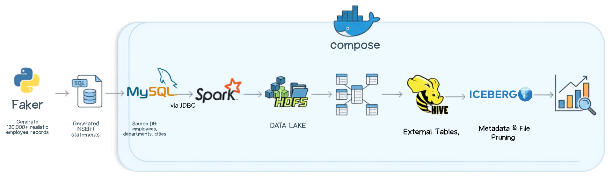
</p>

# Project Overview

This project demonstrates the design and implementation of a complete **Data Engineering pipeline** for an HR Analytics platform using modern Big Data technologies.

the project begins by generating **120,000+ realistic employee records** using **Python** and the **Faker** library. The generated data is exported as SQL scripts and loaded into a relational **MySQL** database. From there, the project performs ETL processing with **Apache Spark**, stores processed datasets in **HDFS** as **Parquet** files, builds a **Star Schema Data Warehouse**, creates **External Hive Tables**, and stores the same analytical dataset in **Apache Iceberg** for performance comparison.

The project also evaluates different query optimization techniques by comparing analytical queries executed on:

- MySQL
- Apache Hive
- Apache Iceberg

In addition to the data engineering pipeline, the project implements several database administration tasks, including automated database backups, restore testing, server resource monitoring, role-based access control, slow query detection, query optimization using indexes, and execution plan analysis.

The entire environment is fully containerized using **Docker Compose**, making the project reproducible and easy to deploy.

# Project Objectives

- Build a fully Dockerized Data Engineering environment.
- Generate realistic HR data using Python and Faker.
- Design a normalized relational database in MySQL.
- Implement an ETL pipeline using Apache Spark.
- Store processed datasets in HDFS using Parquet.
- Build a Star Schema Data Warehouse.
- Create partitioned External Hive Tables.
- Store analytical datasets as Apache Iceberg tables.
- Compare query execution across MySQL, Hive, and Iceberg.
- Automate MySQL database backups.
- Validate database restore procedures.
- Monitor database server resources.
- Implement role-based access control.
- Optimize SQL queries using indexes and execution plans.

---

# Project Structure

```text
Enterprise-HR-Analytics/
│
├── docker-compose.yml
│
├── scripts/
│   ├── 01_create_database.sql
│   ├── 02_create_tables.sql
│   ├── 03_employees.sql
│   ├── 04_departments.sql
│   ├── 05_cities.sql
│   ├── 06_security.sql
│   ├── 07_performance_tuning.sql
│   └── ...
│
├── notebooks/
│   ├── 01_generate_data.ipynb
│   ├── 02_etl_pipeline.ipynb
│   ├── 03_hive.ipynb
│   └── 04_iceberg.ipynb
│
├── docs/
│   ├── architecture.png
│   ├── workflow.png
│   ├── er_diagram.png
│   └── star_schema.png
│
├── README.md
│
└── LICENSE
```

# Implementation

This section describes the implementation of each task required in the technical assessment.

---

# Task 1 – Create MySQL Database

## Objective

Create a normalized MySQL database, populate it with more than **120,000 realistic employee records**, and execute an intentionally unoptimized SQL query that can later be optimized.

---

## 1.1 Database

The source database was implemented using **MySQL 8**, running inside a Docker container.

Database name:

```sql
source_db
```

The database consists of three tables:

| Table       | Description                 |
| ----------- | --------------------------- |
| employees   | Stores employee information |
| departments | Department lookup table     |
| cities      | City lookup table           |

## 1.2 Data Generation using Python Faker

Initially, the dataset generation was attempted using SQL scripts only. However, generating a large dataset with realistic distributions and sufficient variation in employee attributes (such as names, salaries, hire dates, and job titles) proved to be limited and difficult to maintain.

Instead of manually creating sample records, a Python script was developed using the **Faker** library to generate realistic HR data.

The script generates a SQL file (`03_employees.sql`) containing **120,000+ employee records**, which are later imported into MySQL.

### Business Rules

The generated dataset follows simple business rules to make it suitable for analytical workloads.

- Employees belong to one of 10 departments.
- Departments have different employee distributions.
- Each department has department-specific job titles.
- Salary ranges depend on the employee's job title.
- Bonuses are calculated from the employee's performance score.
- Employees have realistic birth dates.
- Hire dates range between **2015** and **2025**.
- Employment status is distributed among:
  - Active
  - On Leave
  - Resigned

The Departments and Cities tables are static lookup tables populated separately using SQL scripts.

---

## 1.3 Loading Data into MySQL

The generated SQL script was copied into the MySQL Docker container and executed to populate the Employees table.
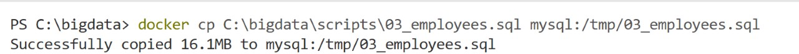

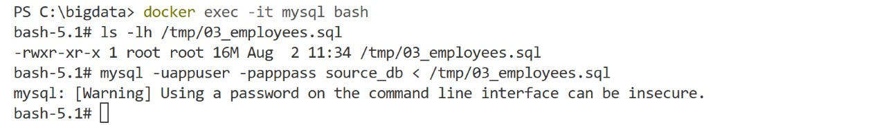

After importing the data, the Employees table contained more than **120,000 records**.

Example verification:

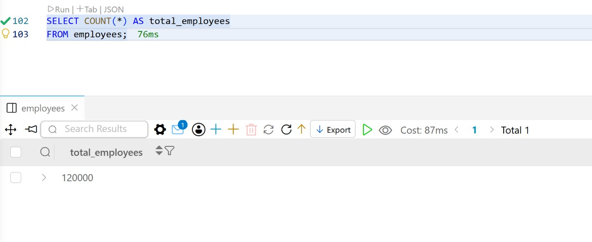

---

## 1.4 Unoptimized Query

To demonstrate SQL performance tuning later in the project, an intentionally unoptimized query was executed.

Example:

```sql
SELECT *
FROM employees
WHERE first_name = 'Ahmed';
```

Since no index existed on the `first_name` column, MySQL performed a **Full Table Scan**, reading every row in the table.

Execution plan:

```sql
EXPLAIN
SELECT *
FROM employees
WHERE first_name = 'Ahmed';
```

The execution plan showed:

- Access Type: ALL
- Key Used: NULL
- Full Table Scan
- Using WHERE

This query serves as the baseline before adding indexes during **Task 10**.


---

# Task 2 – Transfer Data to Big Data Environment

## Objective

Transfer the source data from MySQL into Hadoop using **Apache Spark JDBC**.

---

## 2.1 Spark JDBC Connection

Apache Spark was configured to connect directly to the MySQL container using the MySQL JDBC driver.

Connection parameters included:

- JDBC URL
- Database name
- Username
- Password
- MySQL JDBC Driver

Spark reads the tables directly without exporting intermediate CSV files.

---

## 2.2 Reading Data from MySQL

The following tables were loaded into Spark DataFrames:

- employees
- departments
- cities

Example:

```python
employees = spark.read.jdbc(
    url=jdbc_url,
    table="employees",
    properties=connection_properties
)
```

The same approach was used for the remaining tables.

---

## 2.3 Writing Raw Data to HDFS

After extraction, the source tables were written to HDFS in **Parquet** format.
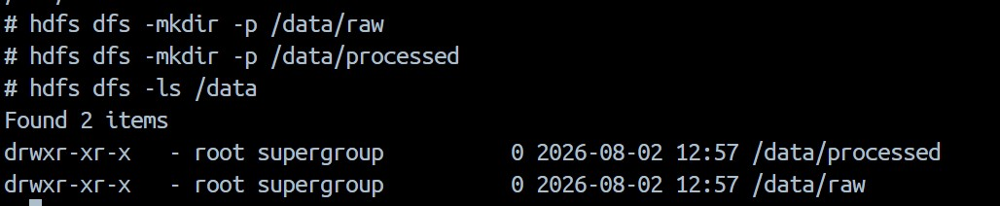
Directory structure:

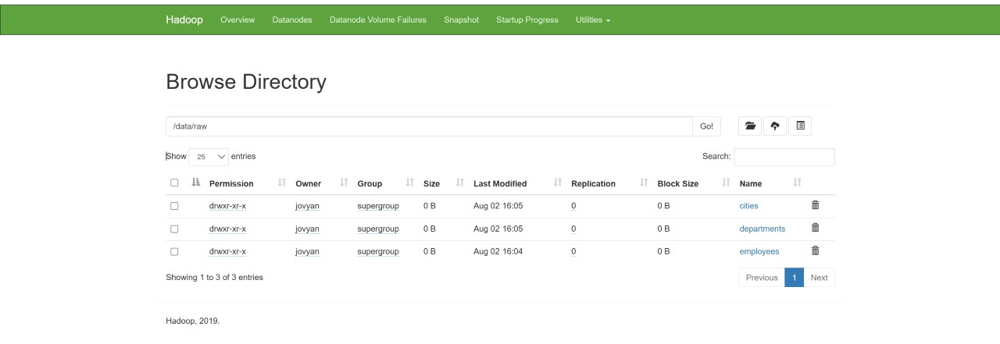
Using Parquet at this stage provides:

- Columnar storage
- Compression
- Better Spark performance
- Efficient storage for analytical workloads

---

# Task 3 – Process Data with Spark

## Objective

Read the datasets from the Raw Zone, apply business transformations, and build the analytical data warehouse.

The ETL process follows three logical storage layers:

```text
Raw Layer
      │
      ▼
Processed Layer
      │
      ▼
Warehouse Layer
```

Perform basic transformations using Apache Spark and store the processed dataset as **partitioned Parquet files** before exposing them through External Hive Tables.

---

## 3.1 Data Transformations

Several business-oriented transformations were applied to enrich the operational data.

### Hire Year

Extracted from the Hire Date column.

This field is later used as the partition column.

---

### Salary Band

Employees are categorized into salary groups.

| Salary          | Category |
| --------------- | -------- |
| < 15,000        | Low      |
| 15,000 – 25,000 | Medium   |
| > 25,000        | High     |

---

## 3.2 Writing Processed Data

The transformed DataFrames were stored in HDFS using **Apache Parquet**.

Directory structure:

## 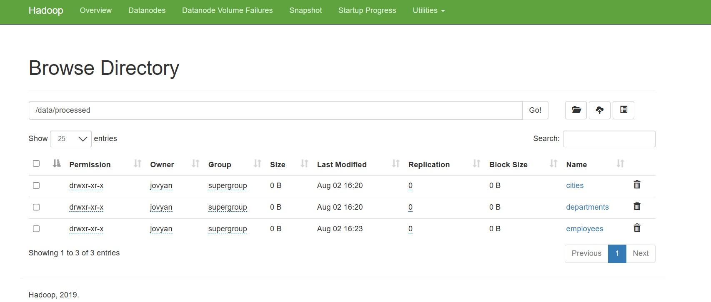

## 3.3 Building the Data Warehouse

Using the processed datasets, a Star Schema data warehouse was created.

The warehouse consists of one fact table and three dimension tables.

Warehouse structure:

```text
/ data / warehouse /

├── fact_employee/
├── dim_employee/
├── dim_department/
└── dim_city/
```

The warehouse tables are stored as Apache Parquet files and serve as the source for Hive External Tables and Apache Iceberg.

## 3.4 Why Apache Parquet?

Parquet was selected because it offers several advantages for analytical processing:

- Column-oriented storage
- Built-in compression
- Reduced storage requirements
- Faster scan performance
- Native integration with Spark, Hive, and Iceberg

---

## 3.5 Partitioning Strategy

The Employees dataset was partitioned by **hire_year**.

```text
partitionBy("hire_year")
```

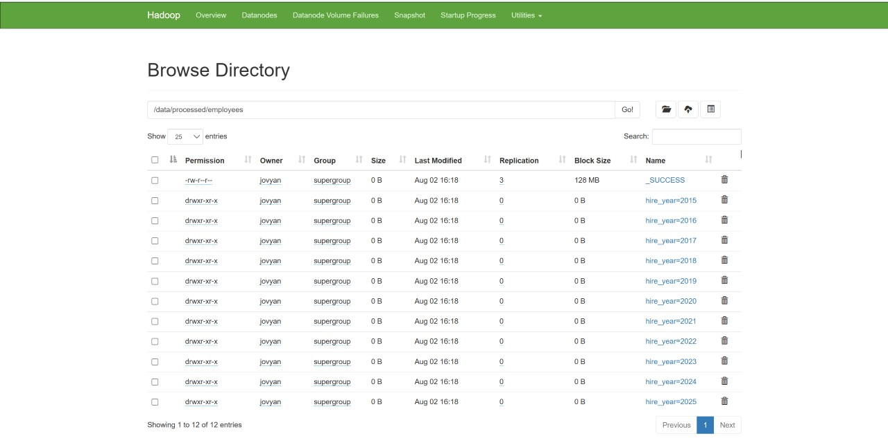

### Why hire_year?

The `hire_year` column was selected because HR analytical queries commonly filter employees by hiring period.

Examples include:

- Employees hired in 2023
- Hiring trends by year
- Average salary of employees hired after 2020

Partitioning by `hire_year` allows Spark and Hive to read only the required partitions instead of scanning the entire dataset, significantly reducing disk I/O and improving query performance.

---

## 3.6 Creating External Hive Tables

After building the data warehouse, the Parquet files stored in HDFS were registered as **External Hive Tables** using **Apache Spark SQL** with **Hive support enabled**.

Spark was configured to connect to the Hive Metastore, allowing Hive tables to be created and managed directly from the Spark session. This approach integrates data processing and metadata management within a single environment.

The external tables were created using Spark SQL (`spark.sql(...)`), while the actual data remained stored as Parquet files in HDFS.

Unlike managed tables, external tables store only the metadata inside the Hive Metastore, while the actual data remains in HDFS. This allows the data to be accessed by multiple processing engines, such as Apache Spark and Apache Hive, without duplicating the data.

The warehouse consists of the following external tables:

| Table          | Type     |
| -------------- | -------- |
| fact_employee  | External |
| dim_employee   | External |
| dim_department | External |
| dim_city       | External |

The fact table was partitioned by **hire_year** to support partition pruning during query execution.
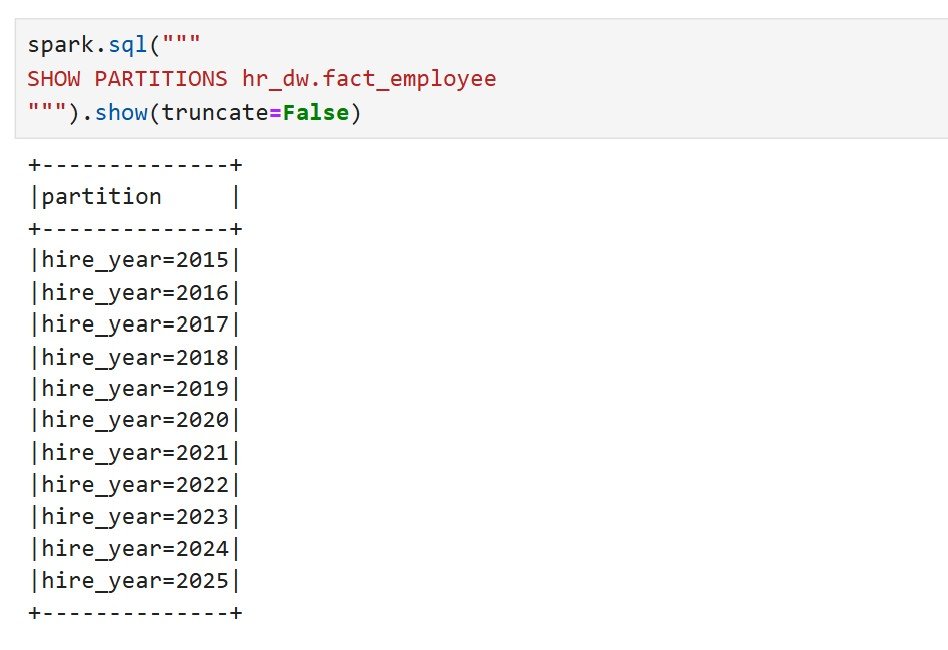
Files in warhouse folder
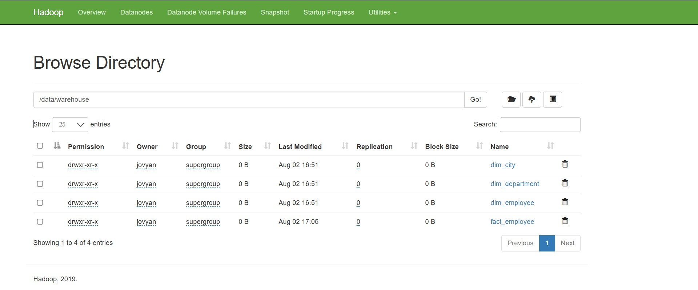
The db called hr_dw were created to contain the hive external tables
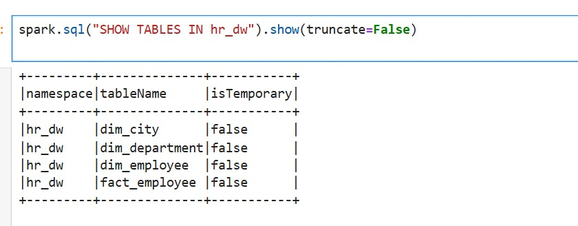

# Task 4 – Run SQL Query Against Hive Table

## Objective

Execute analytical SQL queries against the External Hive tables and demonstrate **partition pruning** using the query execution plan.

---

## 4.1 Querying Hive Tables

Since Hive support is enabled in the Spark session, all SQL queries were executed using **Spark SQL**, which interacts directly with the Hive Metastore.

Example query:

```sql
SELECT COUNT(*)
FROM fact_employee
WHERE hire_year = 2023;
```

This query returns the total number of employees hired during the year 2023.

## 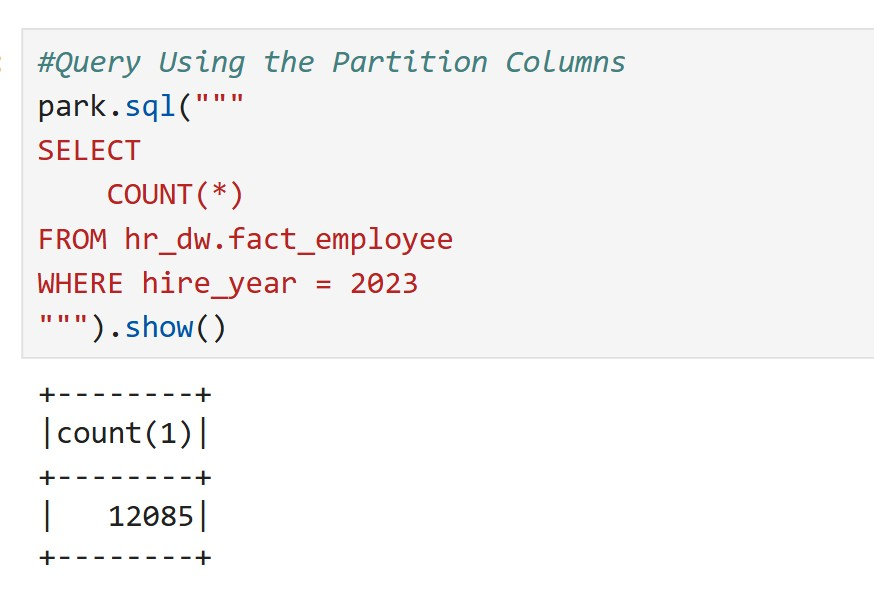

## 4.2 Explain Query Plan

To verify how Spark executes the query, the execution plan was generated using:

```sql
EXPLAIN
SELECT COUNT(*)
FROM fact_employee
WHERE hire_year = 2023;
```

The physical execution plan showed:

- FileScan (Parquet)
- PartitionFilters: `hire_year = 2023`
- Partition Path:
  ```
  hdfs://namenode:8020/data/warehouse/fact_employee/hire_year=2023
  ```

This confirms that only the required partition was scanned.

## 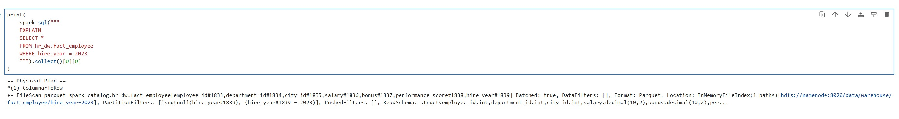

## 4.3 Partition Pruning

The execution plan demonstrates that **partition pruning** occurred successfully.

Instead of scanning every Parquet file inside the warehouse, Spark accessed only the partition corresponding to:

```text
hire_year = 2023
```

This significantly reduces:

- Disk I/O
- Number of files read
- Query execution time

Partition pruning is one of the primary optimization techniques provided by Hive when querying partitioned datasets.

---

# Task 5 – Apache Iceberg

## Objective

Store the same analytical dataset as an **Apache Iceberg** table and compare query execution with MySQL and Hive.

---

## 5.1 Why Apache Iceberg?

Apache Iceberg is a modern table format designed for large-scale analytical workloads.

Compared to traditional Hive tables, Iceberg provides:

- ACID transactions
- Schema evolution
- Hidden partitioning
- Metadata management
- File pruning
- Snapshot support
- Time travel

These features improve scalability and simplify data management.

---

## 5.2 Creating the Iceberg Table

The `fact_employee` dataset was written to an Apache Iceberg table using Spark SQL.

Example:

```sql
CREATE TABLE hr_dw.fact_employee_iceberg
USING iceberg
PARTITIONED BY (hire_year)
AS
SELECT *
FROM hr_dw.fact_employee;
```

The Iceberg table stores its metadata separately while referencing the Parquet data files.

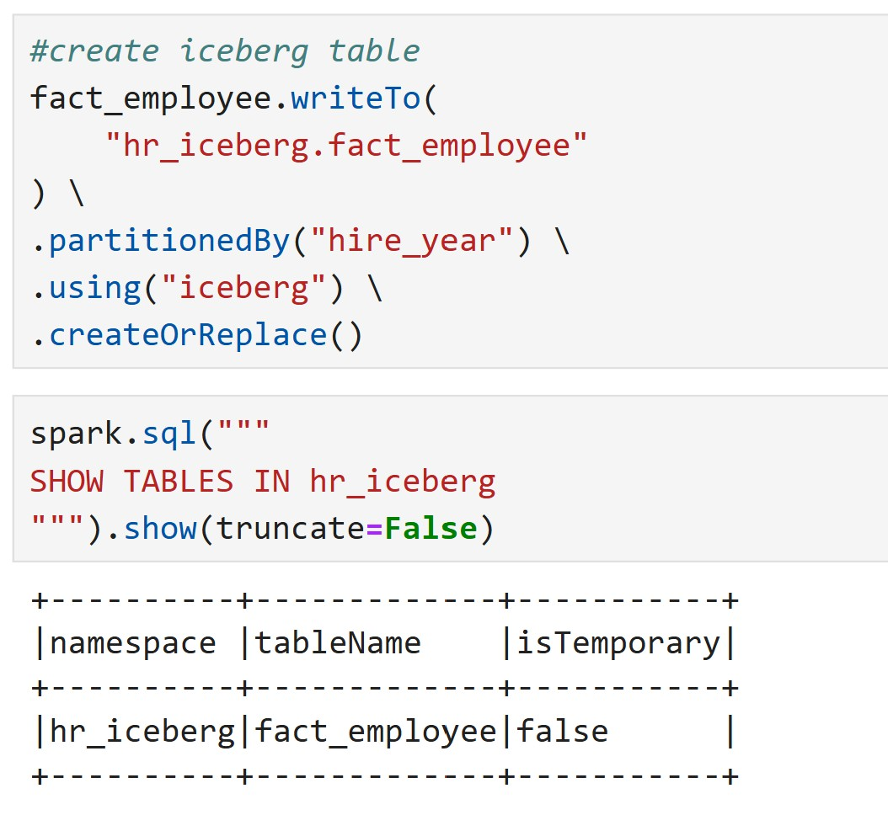

---

## 5.3 Querying the Iceberg Table

The same analytical query used for the Hive table was executed against Iceberg.

```sql
SELECT COUNT(*)
FROM fact_employee_iceberg
WHERE hire_year = 2023;
```

The query returned the same result as the Hive table.

> **Insert Screenshot – Iceberg Query**

---

## 5.4 Iceberg Query Plan

The execution plan was generated using:

```sql
EXPLAIN
SELECT COUNT(*)
FROM fact_employee_iceberg
WHERE hire_year = 2023;
```

The plan shows that Iceberg performs metadata-based file pruning before reading data files.

Instead of scanning every data file, Iceberg identifies only the files that contain records for the requested partition.

This reduces:

- Metadata scanning
- File scanning
- Disk I/O

and improves query performance for large datasets.

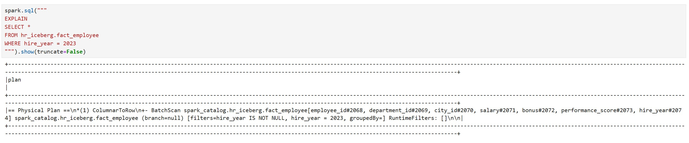

---

## 5.5 Performance Comparison

The same analytical query was executed against:

- MySQL
- Hive External Table
- Apache Iceberg

Query:

```sql
SELECT COUNT(*)
FROM employees
WHERE hire_date >= '2023-01-01'
  AND hire_date < '2024-01-01';
```

| Technology | Optimization Technique     | Query Time\* | Best Use Case                   |
| ---------- | -------------------------- | -----------: | ------------------------------- |
| MySQL      | B-tree Index (`hire_date`) |     ~34.2 ms | OLTP, transactional workloads   |
| Hive       | Partition Pruning          |      0.427 s | Batch analytics                 |
| Iceberg    | Metadata + File Pruning    |      0.261 s | Large-scale data lake analytics |

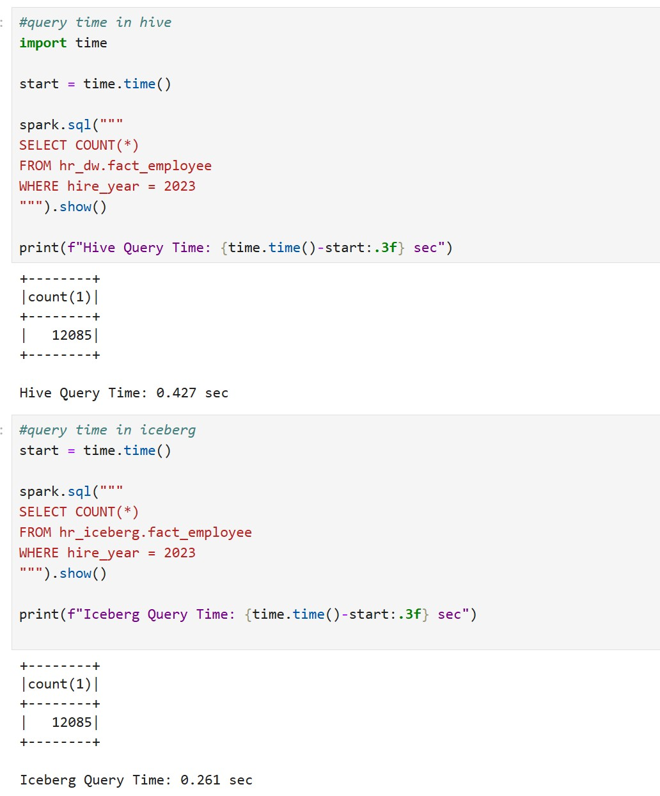
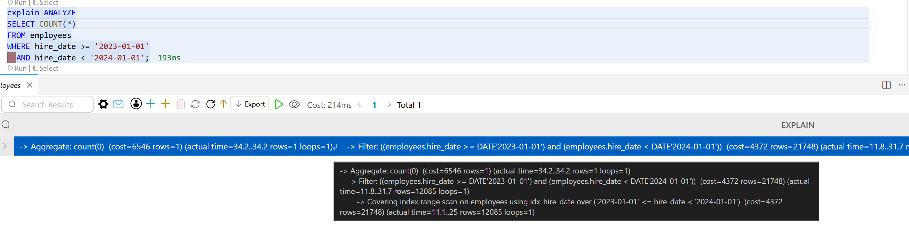

---

## 5.6 Optimization Techniques

### MySQL

MySQL uses a **B-tree index** on the `hire_date` column.

The query optimizer performs an **Index Range Scan**, reading only the matching rows instead of scanning the entire table.

---

### Hive

Hive improves query performance using **partition pruning**.

Since the fact table is partitioned by `hire_year`, only the required partition is scanned.

---

### Apache Iceberg

Iceberg extends partition pruning by maintaining table metadata that describes every data file.

Before reading Parquet files, Iceberg uses metadata to eliminate files that cannot satisfy the query predicate.

This process is known as **metadata/file pruning**.

---

## 5.7 When to Use Each Technology

| Technology     | Recommended Usage                                                                                            |
| -------------- | ------------------------------------------------------------------------------------------------------------ |
| MySQL          | Transactional systems, CRUD operations, small to medium datasets                                             |
| Hive           | Batch analytics over partitioned data stored in HDFS                                                         |
| Apache Iceberg | Modern data lake architectures requiring ACID transactions, schema evolution, and high-performance analytics |

---

## Summary

The comparison demonstrates how different storage technologies optimize analytical queries:

- **MySQL** improves performance using **indexes**.
- **Hive** reduces scan cost using **partition pruning**.
- **Apache Iceberg** further optimizes analytical queries through **metadata and file pruning**, making it well suited for large-scale data lake environments.

# Task 6 – Automate Daily Backups

## Objective

Automate regular backups of the MySQL database to ensure data can be recovered in case of accidental deletion or system failure.

---

## 6.1 Development Environment

The assessment assumes a Linux environment using **Cron**.

However, this project was developed on **Windows** using **Docker Desktop**. Since the host operating system does not provide native Linux Cron, a different approach was used.

The backup process was automated using a **separate, dedicated Docker container** running `cron`, which executes `mysqldump` against the MySQL container via the Docker socket. This keeps the backup logic isolated from the database container itself while remaining fully Dockerized.

This approach makes the project portable across different operating systems without depending on the host machine.

---

## 6.2 Backup Script

A shell script was created to generate SQL backups using the `mysqldump` utility.

The script performs the following steps:

- Creates the backup directory if it does not exist.
- Generates a timestamped backup filename.
- Executes `mysqldump`.
- Stores the SQL dump.
- Reports whether the backup completed successfully.

A `crontab` file schedules the script to run automatically every day at 2:00 AM (container timezone set to match local time).

files:
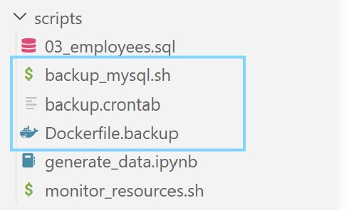

Example output:


## 6.3 Backup Verification

The generated SQL dump was verified to ensure that the database could be restored successfully.

The backup file contains:

- Database schema
- Table definitions
- Employee records
- Department records
- City records

---

## 6.4 Restore Test

To verify that the generated backup was valid, it was restored into a **separate MySQL Docker container** (`mysql_restore`).


# Task 7 – Test Restore

## Objective

Verify that the generated backup can be restored successfully.

---

## 7.1 Restore Procedure

The SQL backup file was restored into a separate MySQL database.

Example:

```bash
mysql -u appuser -papppass restored_db < backup.sql
```

---

## 7.2 Validation

The restore process was validated by comparing the restored database with the original database.

Validation steps included:

- Verifying all tables were recreated.
- Checking the employee count.
- Confirming foreign key relationships.
- Executing sample queries.

I performed exec to the container:


```sql
SELECT COUNT(*)
FROM employees;
```

The restored database contained the same number of records as the source database.

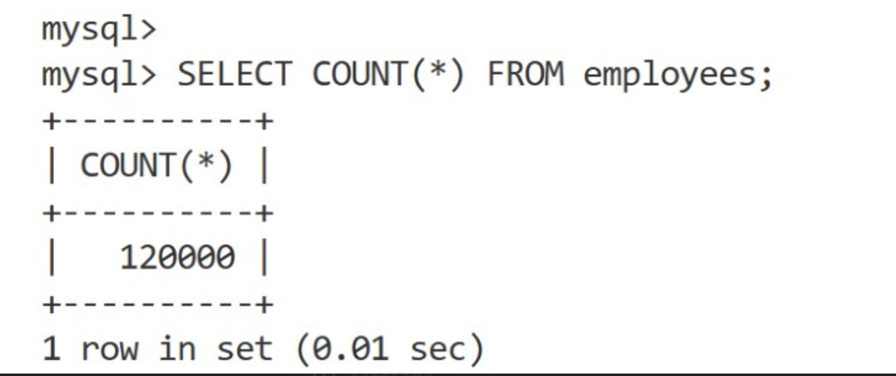

---

# Task 8 – Monitor Database Server Resources

## Objective

Monitor the health of the MySQL server and detect potentially destructive SQL operations.

---

## 8.1 Resource Monitoring

A monitoring script was developed to periodically collect database server statistics.

The script reports:

- CPU utilization
- Memory usage
- Disk utilization

These metrics help identify resource bottlenecks during query execution.

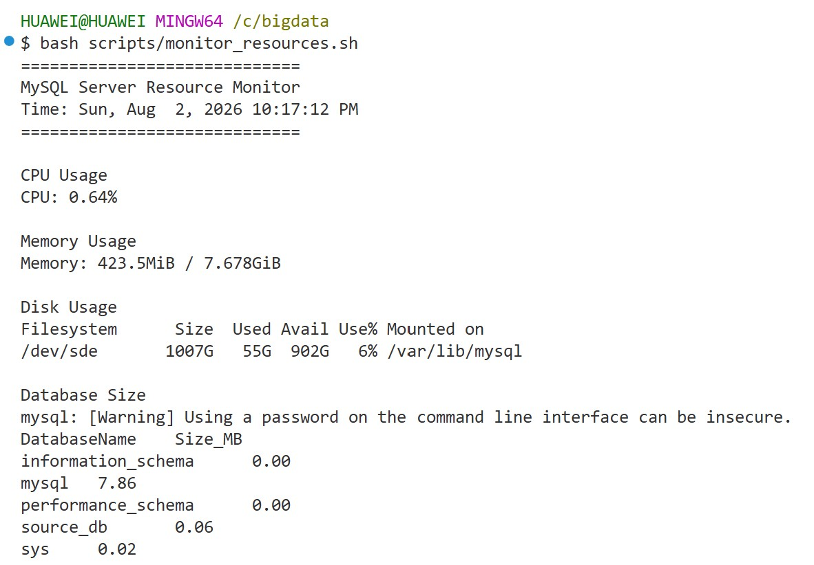

---

## 8.2 Monitoring Destructive Commands

Basic monitoring was implemented to detect potentially destructive SQL statements, including:

- DROP DATABASE
- DROP TABLE
- TRUNCATE TABLE
- DELETE

This provides a simple auditing mechanism for high-risk database operations.

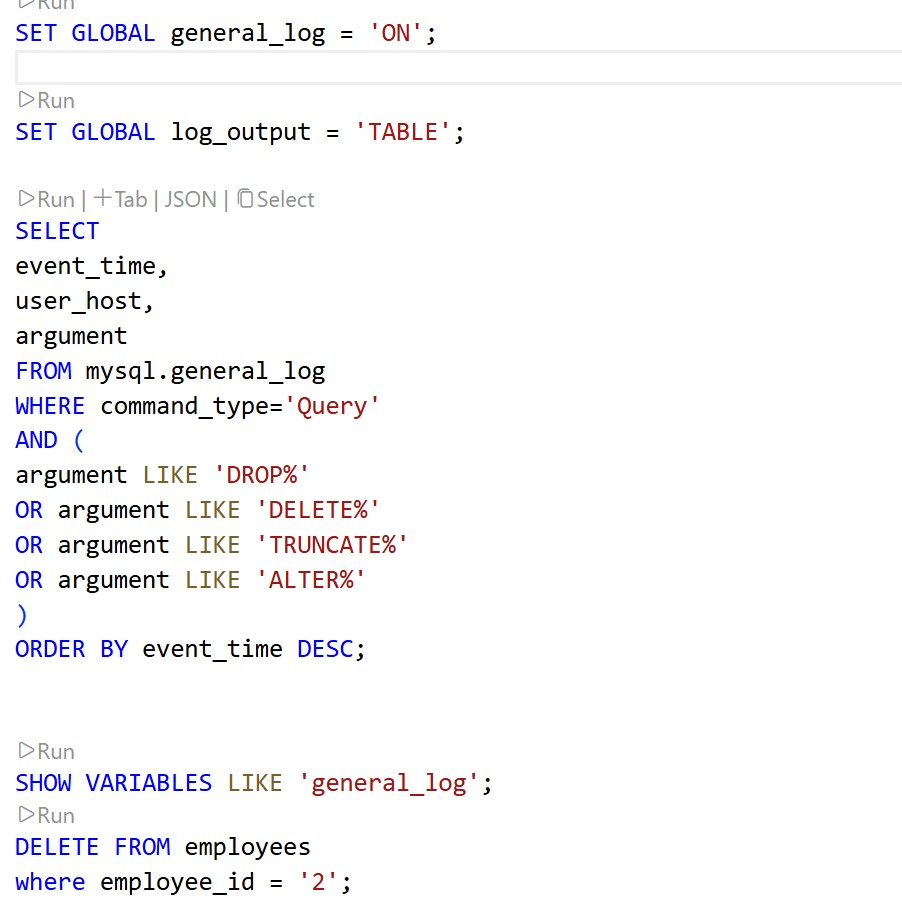

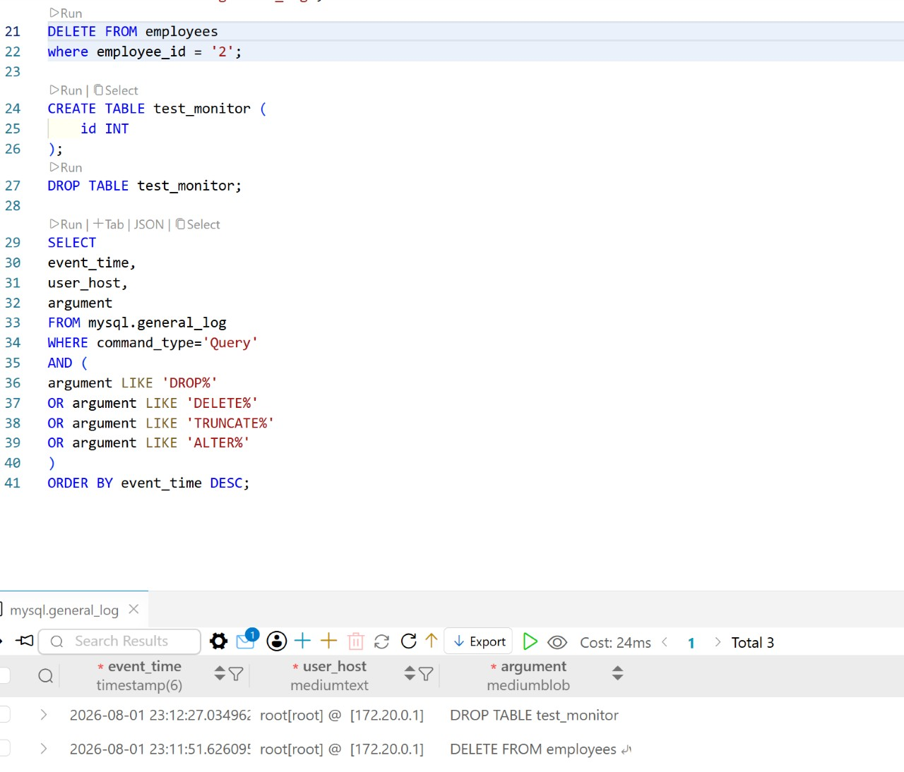

---

# Task 9 – Access Control

## Objective

Implement role-based access control by creating database users with different privilege levels.

---

## 9.1 User Roles

Two database users were created.

| User          | Permissions                    |
| ------------- | ------------------------------ |
| admin_user    | Full administrative privileges |
| readonly_user | Read-only access               |

---

## 9.2 Granted Privileges

### Administrator

The administrator account was granted privileges to:

- SELECT
- INSERT
- UPDATE
- DELETE
- CREATE
- ALTER
- DROP

---

### Read-Only User

The read-only account was granted only:

```sql
SELECT
```

This user can query the database but cannot modify any data.

---

## 9.3 Validation

The assigned privileges were verified using:

```sql
SHOW GRANTS FOR 'admin_user'@'%';

SHOW GRANTS FOR 'readonly_user'@'%';
```

Both accounts behaved as expected during testing.

admin
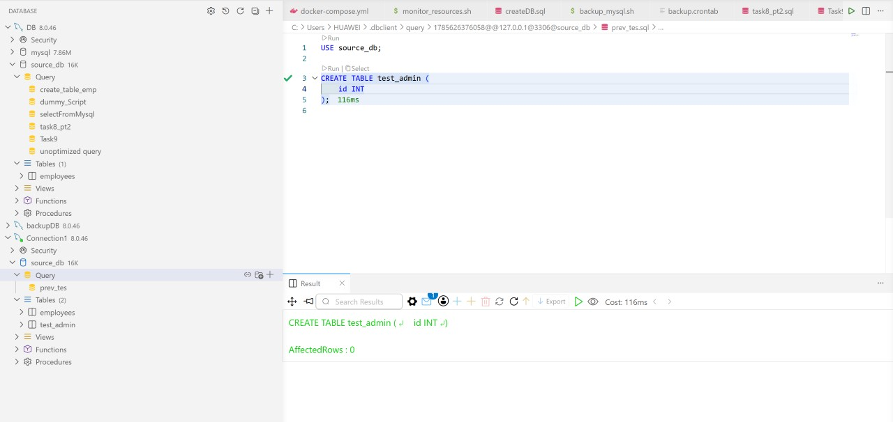

read only user
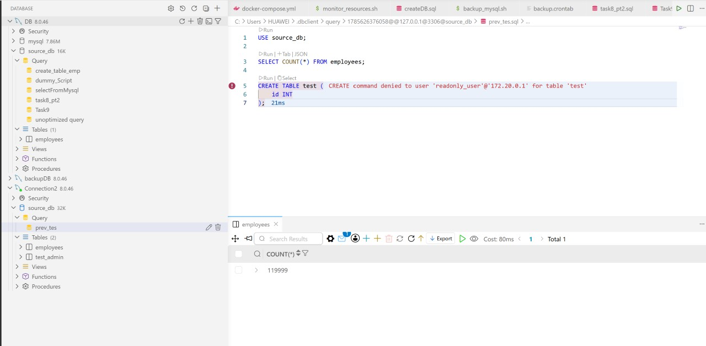

# Task 10 – Performance Tuning

## Objective

Analyze SQL query performance, detect slow queries, improve performance using indexes, and compare execution plans.

---

## 10.1 Detecting a Slow Query

An intentionally unoptimized query was executed to demonstrate MySQL's execution behavior.

```sql
SELECT *
FROM employees
WHERE first_name = 'Ahmed';
```

Since no index existed on the `first_name` column, MySQL performed a **Full Table Scan**.

Execution plan:

```sql
EXPLAIN
SELECT *
FROM employees
WHERE first_name = 'Ahmed';
```

The execution plan showed:

- Access Type: ALL
- No index used
- Full table scan
- Using WHERE

## 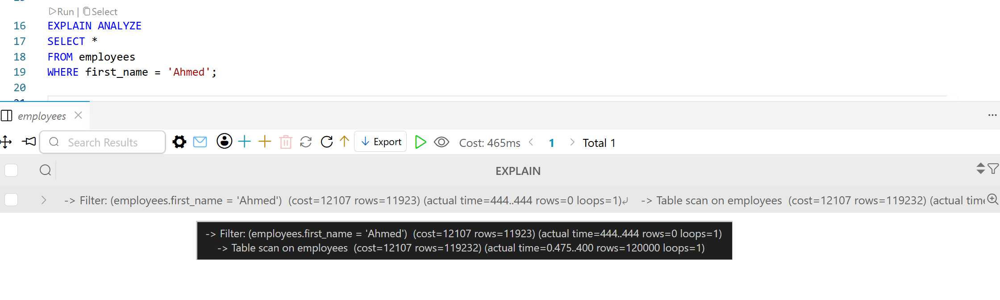

## 10.2 Adding an Index

To improve query performance, an index was created on the `first_name` column.

```sql
CREATE INDEX idx_first_name
ON employees(first_name);
```

---

## 10.3 Optimized Execution

The same query was executed again after creating the index.

```sql
EXPLAIN ANALYZE
SELECT *
FROM employees
WHERE first_name = 'Ahmed';
```

The optimizer switched from a full table scan to an index lookup, reducing the number of scanned rows and improving query performance.

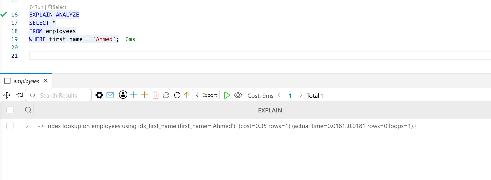

---

## 10.4 Before vs After

| Before Optimization | After Optimization |
| ------------------- | ------------------ |
| Full Table Scan     | Index Lookup       |
| Access Type: ALL    | Access Type: ref   |
| No Index            | idx_first_name     |
| Higher Query Cost   | Lower Query Cost   |

The execution plans clearly demonstrate the benefit of indexing for frequently filtered columns.

---

## Summary

The performance tuning process showed how MySQL query performance can be significantly improved by replacing full table scans with indexed lookups. Proper indexing reduces I/O, lowers execution cost, and enables the optimizer to retrieve matching records more efficiently.

# Written Questions

## Q1. You have 500,000 small files landing in HDFS. What is the problem, and how would you solve it?

### Problem

Having a very large number of small files in HDFS leads to the **Small Files Problem**.

Each file consumes metadata in the NameNode memory, regardless of its size. As the number of files increases, the NameNode requires more memory to manage the filesystem metadata, which can degrade cluster performance.

In addition, Spark and Hive must open and read each file individually, increasing scheduling overhead and reducing query performance.

### Solution

Several approaches can be used to mitigate the small files problem:

- Merge small files into larger Parquet files.
- Configure Spark to write fewer output files (e.g., using `repartition()` or `coalesce()`).
- Store data using columnar formats such as Parquet.
- Use Apache Iceberg, which manages data files more efficiently and supports file compaction.

These techniques reduce metadata overhead and improve analytical query performance.

---

## Q2. If the data volume grew 100×, what would you change in your pipeline, storage format, and cluster design?

If the dataset increased by a factor of 100, several improvements would be required.

### Pipeline

- Increase Spark parallelism.
- Tune partition sizes.
- Process data incrementally instead of performing full loads.
- Introduce workflow orchestration (like Apache Airflow) for scheduling.

### Storage

- Continue using Apache Parquet for columnar storage.
- Prefer Apache Iceberg for managing very large datasets because of:
  - ACID transactions
  - Schema evolution
  - Hidden partitioning
  - Metadata and file pruning
  - Snapshot management

### Cluster Design

- Scale the Hadoop cluster by adding additional DataNodes.
- Increase executor memory and CPU resources for Spark.
- Configure replication and storage capacity based on expected workload.
- Deploy the services on multiple machines instead of a single-node environment.

---

# Docker Deployment

The entire project was implemented using **Docker Desktop**, allowing every component of the pipeline to run inside isolated containers.

The Docker Compose environment includes:

| Service          | Purpose                       |
| ---------------- | ----------------------------- |
| MySQL            | Source relational database    |
| MySQL Restore    | Restore testing environment   |
| Hadoop NameNode  | HDFS metadata management      |
| Hadoop DataNode  | HDFS data storage             |
| Hive Metastore   | Hive metadata management      |
| Apache Spark     | ETL processing and Spark SQL  |
| Jupyter Notebook | Spark development environment |

All services communicate through the Docker network, making the environment reproducible across different machines.

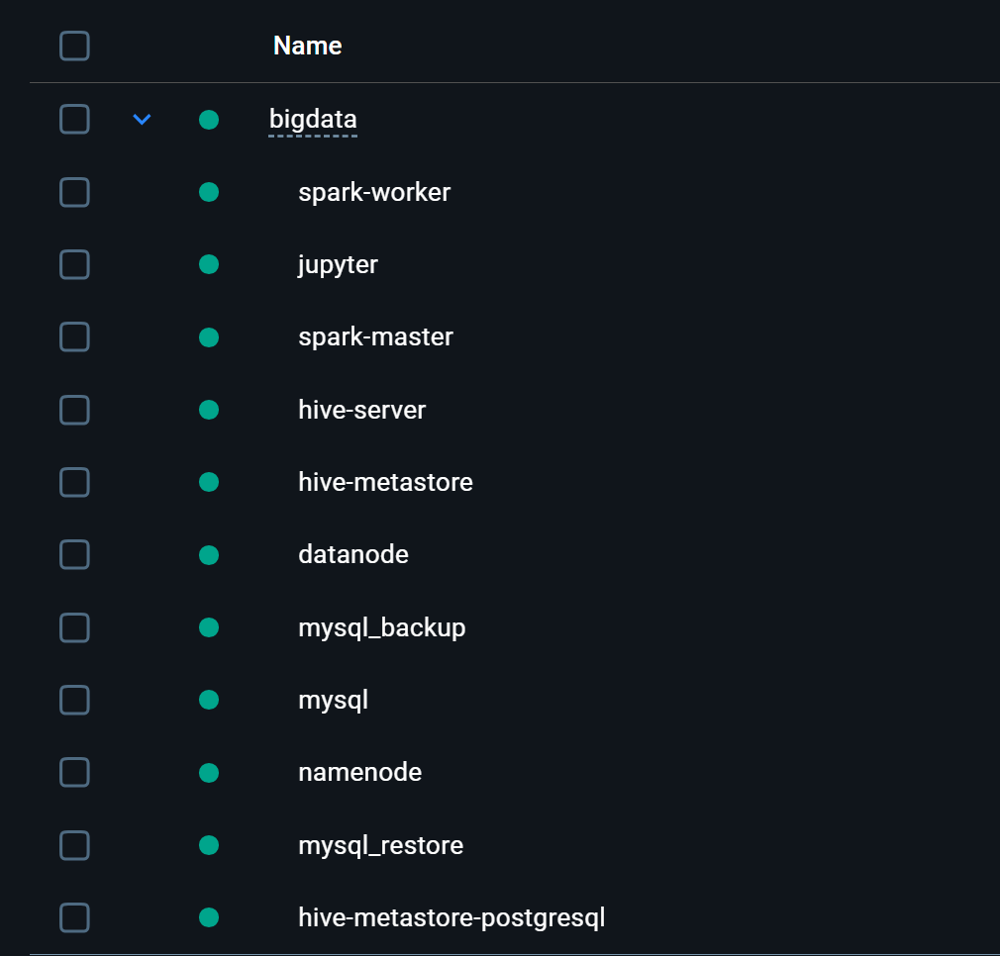

---

# Results

The project successfully implemented all required tasks of the technical assessment.

## Achievements

- Designed and implemented a normalized MySQL database.
- Generated over **120,000 realistic employee records** using Python Faker.
- Transferred relational data into HDFS using Spark JDBC.
- Built Raw, Processed, and Warehouse data layers.
- Stored data in Apache Parquet format.
- Created a Star Schema Data Warehouse.
- Registered the warehouse as External Hive Tables.
- Implemented Apache Iceberg tables.
- Demonstrated Hive partition pruning.
- Compared query execution between MySQL, Hive, and Iceberg.
- Automated MySQL backup generation.
- Successfully restored the backup in a separate MySQL Docker container.
- Implemented basic monitoring for destructive SQL commands.
- Configured role-based database access.
- Optimized SQL queries using indexes and execution plan analysis.
- Containerized the complete environment using Docker Compose.

---

# Future Improvements

Possible future enhancements include:

- Add Apache Airflow for workflow orchestration.
- Implement incremental ETL pipelines.
- Deploy a multi-node Hadoop cluster.
- Add Grafana and Prometheus for real-time monitoring.
- Integrate Kafka for real-time data ingestion.
- Automate Iceberg maintenance tasks such as compaction.
- Deploy the project to a cloud platform (AWS, Azure, or Google Cloud).

---

# How to Run

## 1. Clone the repository

```bash
git clone https://github.com/YasmeenAbdallah/BigData.git

cd BigData
```

---

## 2. Start the Docker environment

```bash
docker compose up -d
```

---

## 3. Verify running containers

```bash
docker ps
```

---

## 4. Create the MySQL tables

Execute the SQL scripts located in:

```text
sql/
```

to create:

- employees
- departments
- cities

---

## 5. Generate Dummy Data

Run the Faker script:

```bash
python scripts/generate_data.py
```

This generates the SQL file containing more than **120,000 employee records**.

---

## 6. Import Data into MySQL

Import the generated SQL file into the MySQL container.

---

## 7. Execute Spark ETL

Run the Jupyter Notebook containing the ETL pipeline.
in folder --> scripts/spark

The notebook performs:

- Spark JDBC extraction
- Raw layer creation
- Processed layer creation
- Warehouse creation
- Hive External Table creation
- Apache Iceberg table creation

---

## 8. Execute Analytical Queries

Run the SQL queries included in the notebook to verify:

- Hive queries
- Partition pruning
- Iceberg queries
- Performance comparison

---

## 9. Backup and Restore

Execute the provided backup script to generate a SQL dump.

Restore the backup into the dedicated **mysql_restore** container to validate recovery.

---

## 10. Performance Tuning

Run the SQL scripts inside the `sql/` folder to:

- Detect slow queries
- Create indexes
- Compare execution plans

# Repository Structure

```text
HR-BigData-Pipeline/
│
├── backups/
│   └── source_db_<timestamp>.sql          # Generated MySQL backup files
│
├── images/                               # Screenshots used in the README
│
├── mysql/
│   └── init/
│       ├── create_tables.sql             # Database schema creation
│       ├── monitoring.sql                # Monitoring destructive SQL commands
│       ├── optimization.sql              # Query optimization and indexing
│       ├── permissions.sql               # User roles and privileges
│       ├── task5_mysql_part.sql          # MySQL query used for comparison
│       └── unoptimized.sql               # Unoptimized query for performance tuning
│
├── notebooks/
│   ├── generate_data.ipynb               # Faker data generation notebook
│   └── spark.ipynb                       # Spark ETL, Hive, and Iceberg pipeline
│
├── scripts/
│   ├── generate_data.py                  # Generates 120,000+ employee records using Faker
│   ├── 03_employees.sql                  # Generated employee dataset
│   ├── backup_mysql.sh                   # Database backup script
│   ├── backup.crontab                    # Backup scheduling configuration
│   ├── Dockerfile.backup                 # Backup container image
│   └── monitor_resources.sh              # Database resource monitoring script
│
├── spark/
│   ├── conf/
│   │   ├── hive-site.xml                 # Hive configuration
│   │   └── spark-defaults.conf           # Spark configuration (Hive & Iceberg)
│   │
│   └── jobs/                             # Spark job directory
│
├── docker-compose.yml                    # Docker Compose services
├── hadoop.env                            # Hadoop environment configuration
└── README.md                             # Project documentation
```
